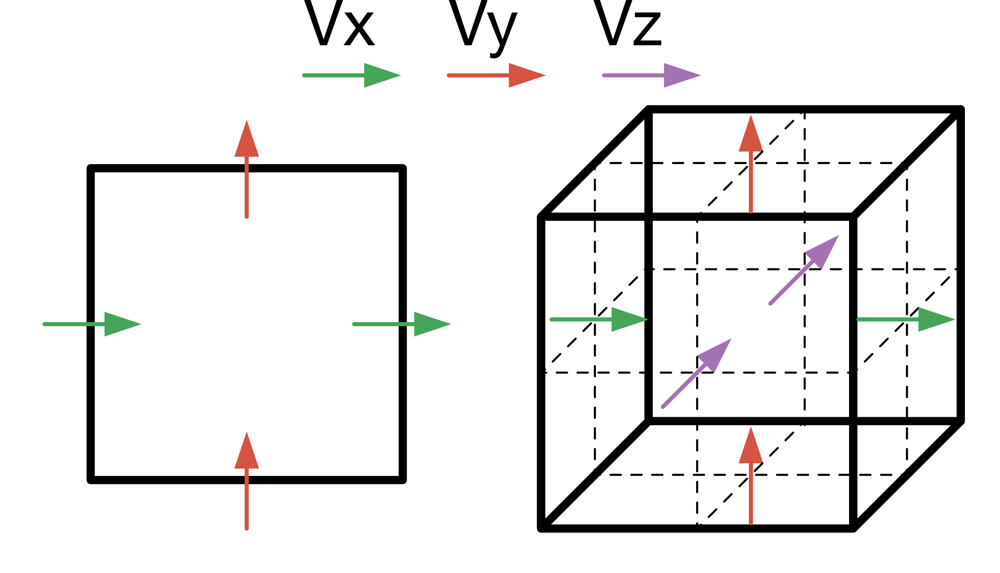

# Summary

# Statement of need

# Related software packages

# Basic usage

Potato \autoref{fig:grid}

# Supported devices and architectures

`JustPIC.jl` seamlessly supports single and multiple CPUs in shared and distributed memory architectures, where it has been tested on Intel, AMD, and ARM chips. Single and multi-GPU architectures from NVidia and AMD are also supported. 

# Examples of usage

In the [example](https://github.com/JuliaGeodynamics/JustPIC.jl/blob/main/docs/src/field_advection3D.md) we show how to set up and run a a 3D simulation, where we advect an arbitrary field $$T=T(z)$$ given the following velocity field:

$$ \mathbf{v}(x, z) = \left(250 \sin(\pi x)\cos(\pi z), 0, -250 \cos(\pi x) \sin(\pi z)\right) $$

<!-- In [`Tutorial_AlpineData.jl`](https://juliageodynamics.github.io/GeophysicalModelGenerator.jl/dev/man/Tutorial_AlpineData/), users learn how to load the topography of the region, import Moho data, load and visualise GPS vectors, import and plot earthquake locations, along with cross-sections through the model (\autoref{fig:alps}).

![Example of combined data of the Alps, which shows the GPS surface velocity (arrows), topography, earthquake locations (colored dots) and cross-sections through a recent anisotropic P-wave tomography model by [@Rappisi_VanderBeek_Faccenda_Morelli_Molinari_2022]. \label{fig:alps}](../src/assets/img/GMG_AlpineData.png){ width=90% } -->

# Acknowledgements

# References