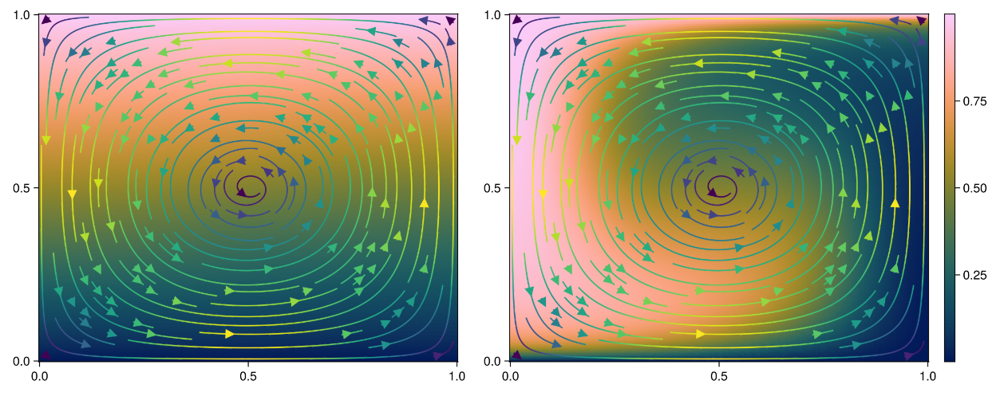

# Summary
Particles-in-cell methods are widely used in geodynamics to advect fields defined in Eulerian grids, as well as to track the the time-history of the material phases (i.e. passive markers) and their associated information. `JustPIC.jl` is a Julia package that provides a flexible and efficient implementation of the Particles-in-Cell. This package is dessigned with performance and portability in mind, running seamlessly in single and multiple CPU -x86 and ARM- and GPU -NVidia and AMD cards- architectures. 

Aside from handling the physical advection of the particles, `JustPIC.jl` also provides a set of tools to interpolate the fields defined in different locations (vertices or cell centers) the Eulerian grid to the particles, and vice versa. This allows for a seamless integration of the particles with the Eulerian grid, and the possibility to advect fields defined in the particles back to the Eulerian grid.

The current version of `JustPIC.jl` is specialized for bi- and tri-dimensional, regular, rectangular, and Cartesian grids where the velocity field is defined in a staggered manner \autoref{fig:grid}, i.e. the velocity components are defined at the center of the cell faces, typical from Finite Differences Stokes solvers used in geodynamic simulations. The package is designed to be easily extensible so that irregular grids, collocated grids, and other coordinates systems can easily implemented.


# Statement of need

# Related software packages


# Basic usage

<!-- Potato \autoref{fig:grid} -->

<!--  -->

# Supported devices and architectures

`JustPIC.jl` seamlessly supports single and multiple CPUs in shared and distributed memory architectures, where it has been tested on Intel, AMD, and ARM chips. Single and multi-GPU architectures from NVidia and AMD are also supported. 

# Example from the documentation
We go through the example of 3D particles avection that can be found in the [documentation](https://github.com/JuliaGeodynamics/JustPIC.jl/blob/main/docs/src/field_advection3D.md) of JustPIC.jl. 

Let use consider an arbitrary field $T=T(z)$, defined in the three-dimesional and non-dimensional domain $\Omega \in [0,1]\times[0,1]\times[0,1]$, that we want to advect in time given the following stationary velocity field:

$$
\mathbf{v}(x, y, z) =
\begin{pmatrix}
250 \sin(\pi x)\cos(\pi z) \\ 
0 \\ 
-250 \cos(\pi x) \sin(\pi z) \\
\end{pmatrix}
$$

`JustPIC.jl` supports bi- and tri-dimensional advection, as well as a CPU or GPU (CUDA and AMD cards) backend. In this example we need the 3D backend and we will run the simulation a CPU, so we initialise the package accordingly:

```julia
using JustPIC, JustPIC._3D
const backend = _3D.CPUBackend
```

Define model size and grids of the vertices and centers of the cells forming the discretized domain:
```julia
# define the model domain
n  = 64             # number of nodes
nx  = ny = nz = n-1 # number of cells in x and y
Lx  = Ly = Lz = 1.0 # domain size
ni  = nx, ny, nz
Li  = Lx, Ly, Lz
xvi = xv, yv, zv = ntuple(i -> range(0, Li[i], length=n), Val(3)) # cell vertices
dxi = dx, dy, dz = ntuple(i -> xvi[i][2] - xvi[i][1], Val(3))     # cell size
```

As it is the standard in CFD solvers using Finite Difference staggered grids, JustPIC.jl assumes that the velocity field has a layer ghost nodes just outside the model domain, to help with the flow boundary boundary conditions. Therefore, we need to add these ghost nodes with help of the `expand_range` function to each one of the velocity grids:
```julia
grid_vx = xv              , expand_range(yc), expand_range(zc) # staggered grid for Vx
grid_vy = expand_range(xc), yv              , expand_range(zc) # staggered grid for Vy
grid_vz = expand_range(xc), expand_range(yc), zv               # staggered grid for Vz
```

Next we initialize the particles object
```julia
nxcell    = 24 # initial number of particles per cell
max_xcell = 48 # maximum number of allowed particles per cell
min_xcell = 14 # minimum number of allowed particles per cell
particles = init_particles(
    backend, nxcell, max_xcell, min_xcell, xvi, dxi, ni
)
```

We initialize the velocity 3D field on the appropriate device. This is done with the help of `TA(backend)`, that will move the given array to the selected backend, with the supported backends being CPU, CUDA, or AMD.
```julia
Vx = TA(backend)([ 250 * sin(π*x) * cos(π*z) for x in grid_vx[1], y in grid_vx[2], z in grid_vx[3]])
Vy = TA(backend)([                       0.0 for x in grid_vy[1], y in grid_vy[2], z in grid_vy[3]])
Vz = TA(backend)([-250 * cos(π*x) * sin(π*z) for x in grid_vz[1], y in grid_vz[2], z in grid_vz[3]])
```

Similarly, we insantiate the arbitrary field $T=T(z)$ defined at the cell vertices and Lagrangian particles
```julia
T   = TA(backend)([z for x in xv, y in yv, z in zv]) # defined at the cell vertices
pT, = init_cell_arrays(particles, Val(1));
grid2particle!(pT, xvi, T, particles)                # interpolate field `T` oto the particles
```

And finally one can start the simulation
```julia
niter = 250
dt = min(dx / maximum(abs.(Vx)), dy / maximum(abs.(Vy)), dz / maximum(abs.(Vz))) / 2
for it in 1:niter
  advection!(particles, RungeKutta2(), (Vx, Vy, Vz), (grid_vx, grid_vy, grid_vz), dt) # advect particles
  move_particles!(particles, xvi, (pT, ))                                             # move particles in the memory
  inject_particles!(particles, (pT, ), xvi)                                           # inject particles if needed
  particle2grid!(T, pT, xvi, particles)                                               # interpolate particles to the grid
end
```



# Acknowledgements

# References