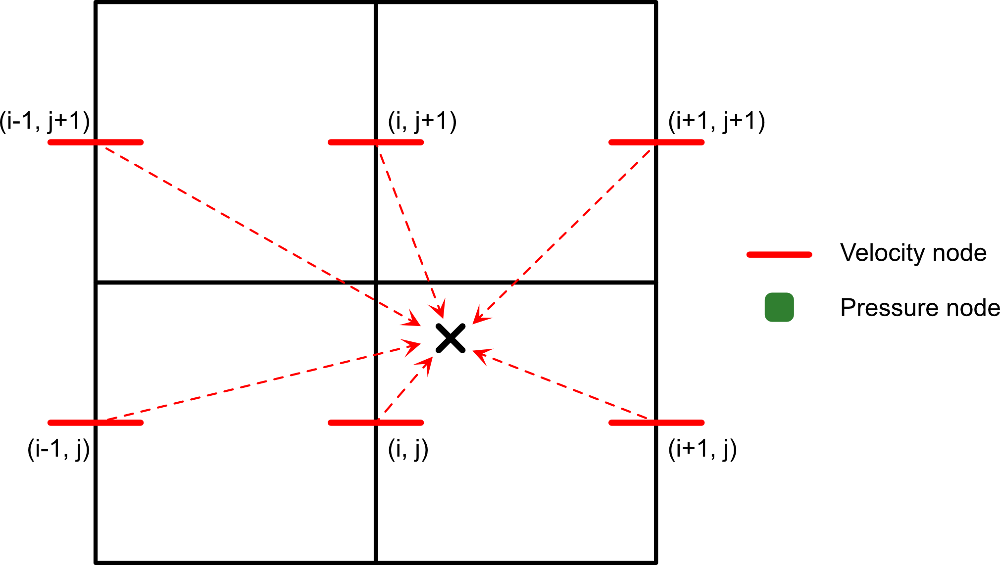

# Summary
Particles-in-cell methods are widely used in geodynamics to advect fields defined in Eulerian grids, as well as to track the the time-history of the material phases (i.e. passive markers) and their associated information. `JustPIC.jl` is a Julia package that provides a flexible and efficient implementation of the Particles-in-Cell. This package is dessigned with performance and portability in mind, running seamlessly in single and multiple CPU -x86 and ARM- and GPU -NVidia and AMD cards- architectures. 

Aside from handling the physical advection of the particles, `JustPIC.jl` also provides a set of tools to interpolate the fields defined in different locations (vertices or cell centers) the Eulerian grid to the particles, and vice versa. This allows for a seamless integration of the particles with the Eulerian grid, and the possibility to advect fields defined in the particles back to the Eulerian grid.

The current version of `JustPIC.jl` is specialized for bi- and tri-dimensional, regular, rectangular, and Cartesian grids where the velocity field is defined in a staggered manner \autoref{fig:grid}, i.e. the velocity components are defined at the center of the cell faces, typical from Finite Differences Stokes solvers used in geodynamic simulations. The package is designed to be easily extensible so that irregular grids, collocated grids, and other coordinates systems can easily implemented.

<!--  -->

<p align="center">
  
</p>

# Statement of need

# Related software packages


# Basic usage

<!-- Potato \autoref{fig:grid} -->

<!--  -->

# Supported devices and architectures

`JustPIC.jl` seamlessly supports single and multiple CPUs in shared and distributed memory architectures, where it has been tested on Intel, AMD, and ARM chips. Single and multi-GPU architectures from NVidia and AMD are also supported.

# Features

## Particles advection

### Velocity interpolation
`JustPIC.jl` supports three different kinds of interpolation of the velocity field onto the particles

- Bi/Tri-Linear interpolation

The velocity field is linearly interpolated from the corresponding $V_i$ grid onto the particles. Bi- and tri-linear interpolation over a rectangular or cubic cells is a linear combination of linear interpolation (also referred as _lerp_) kernels. For example, the bilinear interpolation requires two lerps along the left and right hand side boundaries of the cell, followed by a lerp on the horizontal direction; on the other hand, tri-linear interpolation is a combination of two bilinear kernels and one lerp. 

N-linear interpolation is implemented in a recursive way to exploit compiler (such as automatic vectorization) optimizations and reduce boilerplate code. Since in practical terms we will do up to tri-linear interpolation the maximum recursion depth is five, the stack will never overflow, 

The one dimensional linear interpolation kernel (also referred as _lerp_) is defined as 

$v_{\text{p}} = t v_0  + (1 -t) v_1$

where the $t$, $v_0$, and $v_1$ are graphically described below.

<figure>
    
    <figcaption>image_caption</figcaption>
</figure>

Numerically, it is more appropriately implemented as a double [fma](https://en.wikipedia.org/wiki/Multiply%E2%80%93accumulate_operation) as it is slightly more accurate than a naive implementation:

```julia
v_p = fma(t, v1, fma(-t, v0, v0))
```

- LinP interpolation

<figure>
    
    <figcaption>image_caption</figcaption>
</figure>

- Modified Quadratic Spline (MQS) interpolation

<figure>
    
    <figcaption>image_caption</figcaption>
</figure>

## Other interpolations:

### Grid to particles

### Particles to grid

## Phase ratios calculations

In, for example, geodynamic simulations, it is common to track the time-history of the compositional phases (i.e. passive markers) and their associated information. The phase ratios are calculated as the ratio of the number of particles of a given phase to the total number of particles at different cell locations:

- Cell vertices
- Cell centers
- Velocity nodes 
- Shear stress nodes (in 3D) 


# Parallelization and supported devices

`JustPIC.jl` is designed to run seamlessly in single and multiple CPUs and GPUs. The package is designed to be easily extensible so that irregular grids, collocated grids, and other coordinates systems can easily implemented.

# Examples

We go through the example of 3D particles avection that can be found in the [documentation](https://github.com/JuliaGeodynamics/JustPIC.jl/blob/main/docs/src/field_advection3D.md) of JustPIC.jl. 

## Example 1: single phase advection

Let use consider an arbitrary field $T=T(z)$, defined in the three-dimesional and non-dimensional domain $\Omega \in [0,1]\times[0,1]\times[0,1]$, that we want to advect in time given the following stationary velocity field:

$$
\mathbf{v}(x, y, z) =
\begin{pmatrix}
250 \sin(\pi x)\cos(\pi z) \\ 
0 \\ 
-250 \cos(\pi x) \sin(\pi z) \\
\end{pmatrix}
$$

`JustPIC.jl` supports bi- and tri-dimensional advection, as well as a CPU or GPU (CUDA and AMD cards) backend. In this example we need the 3D backend and we will run the simulation a CPU, so we initialise the package accordingly:

```julia
using JustPIC, JustPIC._3D
const backend = _3D.CPUBackend
```

Define model size and grids of the vertices and centers of the cells forming the discretized domain:
```julia
# define the model domain
n  = 64             # number of nodes
nx  = ny = nz = n-1 # number of cells in the x, y, and z dimensions
Lx  = Ly = Lz = 1.0 # domain size
ni  = nx, ny, nz
Li  = Lx, Ly, Lz
xvi = xv, yv, zv = ntuple(i -> range(0, Li[i], length=n), Val(3)) # cell vertices
dxi = dx, dy, dz = ntuple(i -> xvi[i][2] - xvi[i][1], Val(3))     # cell size
```

As it is the standard in CFD solvers using Finite Difference staggered grids, JustPIC.jl assumes that the velocity field has a layer ghost nodes just outside the model domain, to help with the flow boundary boundary conditions. Therefore, we need to add these ghost nodes with help of the `expand_range` function to each one of the velocity grids:
```julia
grid_vx = xv              , expand_range(yc), expand_range(zc) # staggered grid for Vx
grid_vy = expand_range(xc), yv              , expand_range(zc) # staggered grid for Vy
grid_vz = expand_range(xc), expand_range(yc), zv               # staggered grid for Vz
```

Next we initialize the particles object
```julia
nxcell    = 24 # initial number of particles per cell
max_xcell = 48 # maximum number of allowed particles per cell
min_xcell = 14 # minimum number of allowed particles per cell
particles = init_particles(
    backend, nxcell, max_xcell, min_xcell, xvi, dxi, ni
)
```

We initialize the velocity 3D field on the appropriate device. This is done with the help of `TA(backend)`, that will move the given array to the selected backend, with the supported backends being CPU, CUDA, or AMD.
```julia
Vx = TA(backend)([ 250 * sin(π*x) * cos(π*z) for x in grid_vx[1], y in grid_vx[2], z in grid_vx[3]])
Vy = TA(backend)([                       0.0 for x in grid_vy[1], y in grid_vy[2], z in grid_vy[3]])
Vz = TA(backend)([-250 * cos(π*x) * sin(π*z) for x in grid_vz[1], y in grid_vz[2], z in grid_vz[3]])
```

Similarly, we insantiate the arbitrary field $T=T(z)$ defined at the cell vertices and Lagrangian particles
```julia
# Define field T at the cell vertices
T   = TA(backend)([z for x in xv, y in yv, z in zv])
# Instantiate field T on the particles
T_particles, = init_cell_arrays(particles, Val(1));
# interpolate field `T` onto the particles
grid2particle!(T_particles, xvi, T, particles)
```

And finally one can start the simulation
```julia
niter = 250
dt = min(dx / maximum(abs.(Vx)), dy / maximum(abs.(Vy)), dz / maximum(abs.(Vz))) / 2
for it in 1:niter
  # 1. Advect particles
  advection!(particles, RungeKutta2(), (Vx, Vy, Vz), (grid_vx, grid_vy, grid_vz), dt)
  # 2. Move particles in the memory
  move_particles!(particles, xvi, (T_particles, ))
  # 3. Inject particles if needed
  inject_particles!(particles, (T_particles, ), xvi)
  # 4. Interpolate particles to the grid
  particle2grid!(T, T_particles, xvi, particles)                                               
end
```

<p align="center">
  
</p>

## Example 2: advection of multiple phases


```julia
# define the model domain
n  = 64             # number of nodes
nx  = ny = nz = n-1 # number of cells in the x, y, and z dimensions
Lx  = Ly = Lz = 1.0 # domain size
ni  = nx, ny, nz
Li  = Lx, Ly, Lz
xvi = xv, yv, zv = ntuple(i -> range(0, Li[i], length=n), Val(3)) # cell vertices
dxi = dx, dy, dz = ntuple(i -> xvi[i][2] - xvi[i][1], Val(3))     # cell size
```

As it is the standard in CFD solvers using Finite Difference staggered grids, JustPIC.jl assumes that the velocity field has a layer ghost nodes just outside the model domain, to help with the flow boundary boundary conditions. Therefore, we need to add these ghost nodes with help of the `expand_range` function to each one of the velocity grids:
```julia
grid_vx = xv              , expand_range(yc), expand_range(zc) # staggered grid for Vx
grid_vy = expand_range(xc), yv              , expand_range(zc) # staggered grid for Vy
grid_vz = expand_range(xc), expand_range(yc), zv               # staggered grid for Vz
```

Next we initialize the particles object
```julia
nxcell    = 24 # initial number of particles per cell
max_xcell = 48 # maximum number of allowed particles per cell
min_xcell = 14 # minimum number of allowed particles per cell
particles = init_particles(
    backend, nxcell, max_xcell, min_xcell, xvi, dxi, ni
)
```

Set velocity field
```julia
ε̇bg = -1.0 # background strain rate
Vx  = TA(backend)([ x * ε̇bg for x in grid_vx[1], y in grid_vx[2]])
Vy  = TA(backend)([-y * ε̇bg for x in grid_vy[1], y in grid_vy[2]])
```

Set material phases
```julia
phases, = init_cell_arrays(particles, Val(1))  # cool
phases.data[particles.coords[1].data .<  particles.coords[2].data] .= 1
phases.data[particles.coords[1].data .>= particles.coords[2].data] .= 2
```

Build time stepping and run simulation
```julia
t  = 0.
Δt = C * min(di / max(maximum(abs.(Vx)), maximum(abs.(Vy)))
for it=1:Nt
  # 1. Advect particles
  advection!(particles, RungeKutta2(), values(V), (grid_vx, grid_vy), Δt)
  # 2. Move particles in the memory
  move_particles!(particles, xvi, particle_args);
  # 3. Inject particles if needed
  inject_particles_phase!(particles, phases, (), (), xvi)
end
```


# Acknowledgements

# References