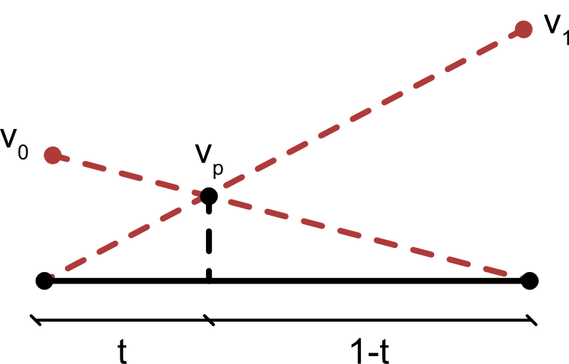

# Particles interpolations

For now, interpolations support only equidistant regular rectangular/cubic grids. Please file and issue if you would be interested in supporting other kind of grids.

## Grid to particle

Information from the grid is linearly interpolated to the particles. The one dimensional linear interpolation kernel (also referred as _lerp_) is defined as 

$v_{\text{p}} = t v_0  + (1 -t) v_1$

where the $t$, $v_0$, and $v_1$ are graphically described below.



Numerically, it is more appropriately implemented as a double [fma](https://en.wikipedia.org/wiki/Multiply%E2%80%93accumulate_operation) as it is slightly more accurate than a naive implementation:

```julia
v_p = fma(t, v1, fma(-t, v0, v0))
```

Bi- and tri-linear interpolation over a rectangular or cubic cells is thus nothing else than a chain of lerp kernels along the different dimensions of the cell. For example, the bilinear interpolation requires two lerps along the left and right sides of the cell, followed by a lerp on the horizontal direction; and trilinear interpolation requires two bilinear kernels and one lerp. 

N-linear interpolation is implemented in a recursive way to exploit compiler optimizations and reduce boilerplate code. Since in practical terms we will do up to tri-linear interpolation the maximum recursion depth is five, so that stack will never overflow.

We can interpolate an arbitrary field $F$ onto the particles with the `grid2particle` function: 

```julia
using JustPIC, JustPIC._2D
# define model domain
nxcell, max_xcell, min_xcell = 24, 30, 12
nx  = ny = 128
Lx  = Ly = 1.0
xvi = range(0, Lx, length=n), range(0, Ly, length=n)
# field F at the grid
F  = [y for x in xv, y in yv]
# instantiate empty `CellArray` 
Fp, = init_cell_arrays(particles, Val(1));
# interpolate F onto Fp
grid2particle!(Fp, xvi, F, particles);
```

## Particle to grid

Information on the particles is currently interpolated to the vertices of the grid cells with an inverse distance weighting interpolant

$v_{i,j} = \frac{\sum^N_{k=1} \omega_k v_k}{\sum^n_{k=1} \omega_k}$

where the weight is $\omega_i = d^{-n}$, with $d$ being the distance between the particle and the node, and $n$ a integer number.

In shared memory environments (e.g. OpenMP parallelism or GPU programming), this particular interpolation often requires the use of atomic operations due to race conditions. In `JustPIC` we do avoid using atomic operations by parallelising over the grid nodes instead of the particles, i.e. we iterated over the nodes, with an inner iteration over the `CellArrays` neighbouring the $i$-th grid node.

This inteprolation is done with the `particle2grid!` function:
```julia-repl
julia> particle2grid!(F, Fp, xvi, particles)
```