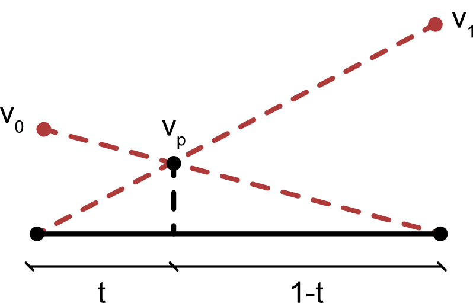

# Interpolations

The interpolation routines in JustPIC currently target equidistant rectangular
2D and 3D grids.

## Grid to particle

Information is transferred from nodal or staggered grids to particle-carried
fields with linear interpolation. The one-dimensional linear interpolation
kernel is

$v_{\text{p}} = t v_0  + (1 -t) v_1$

where the $t$, $v_0$, and $v_1$ are graphically described below.



Numerically, it is more appropriately implemented as a double [fma](https://en.wikipedia.org/wiki/Multiply%E2%80%93accumulate_operation) as it is slightly more accurate than a naive implementation:

```julia
v_p = fma(t, v1, fma(-t, v0, v0))
```

Bi- and tri-linear interpolation over a rectangular or cubic cells is thus nothing else than a chain of lerp kernels along the different dimensions of the cell. For example, the bilinear interpolation requires two lerps along the left and right sides of the cell, followed by a lerp on the horizontal direction; and trilinear interpolation requires two bilinear kernels and one lerp.

N-linear interpolation is implemented recursively to keep the code dimension
agnostic while staying friendly to compiler specialization.

We can interpolate an arbitrary field `F` onto particles with `grid2particle!`:

```julia
using JustPIC, JustPIC._2D
# define model domain
nxcell, max_xcell, min_xcell = 24, 30, 12
nx  = ny = 128
Lx  = Ly = 1.0
xvi = range(0, Lx, length=n), range(0, Ly, length=n)
# field F at the grid
F  = [y for x in xv, y in yv]
# instantiate empty `CellArray`
Fp, = init_cell_arrays(particles, Val(1));
# interpolate F onto Fp
grid2particle!(Fp, F, particles);
```

## Particle to grid

Information on particles can be accumulated back to grid nodes with inverse
distance weighting:

$v_{i,j} = \frac{\sum^N_{k=1} \omega_k v_k}{\sum^n_{k=1} \omega_k}$

where the weight is $\omega_i = d^{-n}$, with $d$ being the distance between the particle and the node, and $n$ a integer number.

On shared-memory hardware this typically requires atomics. JustPIC avoids that
by looping over grid nodes and scanning only the neighboring particle cells that
can contribute to each node.

This interpolation is handled by `particle2grid!`:
```julia-repl
julia> particle2grid!(F, Fp, particles)
```

Related high-level helpers in this workflow are `particle2centroid!`,
`centroid2particle!`, `update_phase_ratios!`, `subgrid_diffusion!`, and
`subgrid_diffusion_centroid!`.
