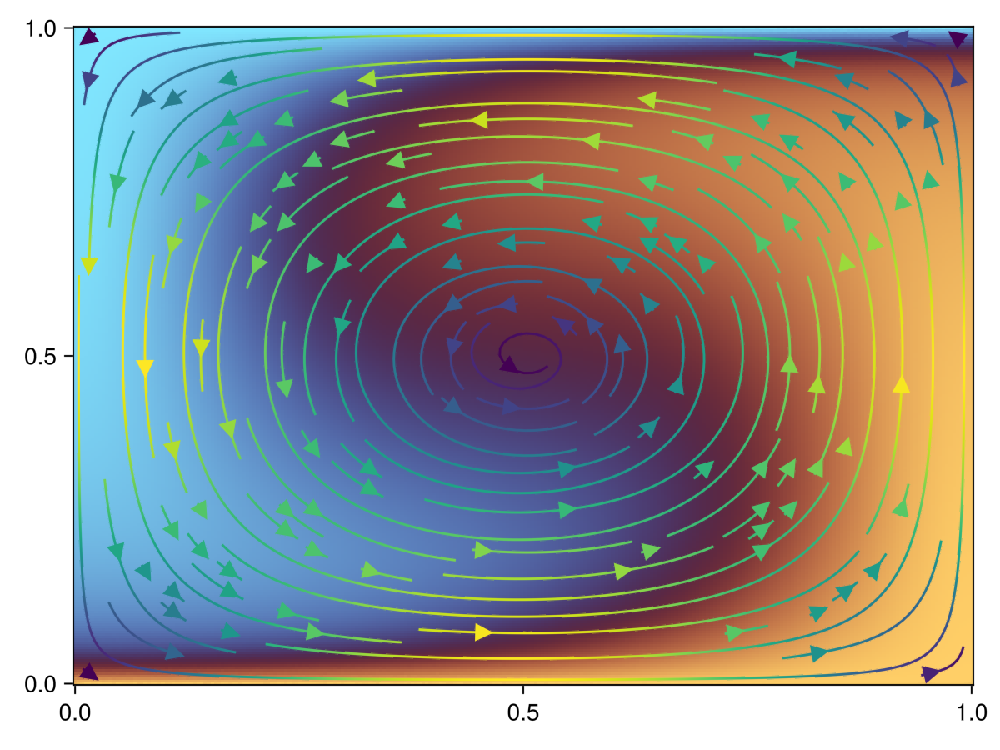

```@meta
EditURL = "temperature_advection.jl"
```

Load JustPIC and its 2D submodule

````@example temperature_advection
using JustPIC, JustPIC._2D
````

For convinience we define the device backend as a constant in our script.
Threads is the default backend;
to run on a CUDA GPU load CUDA.jl and define the backend as CUDABackend,
and to run on an AMD GPU load AMDGPU.jl and define the backend as AMDGPUBackend

````@example temperature_advection
const backend = CPUBackend
````

# Initialize grid and particles
Initialize grid

````@example temperature_advection
n       = 256 # number of vertices
nx = ny = n-1 # number of cells
Lx = Ly = 1.0 # domain x- and -y length
xvi     = xv, yv = range(0, Lx, length=n), range(0, Ly, length=n) # coordinates of the vertices
dxi     = dx, dy = xv[2] - xv[1], yv[2] - yv[1] # grid step
xc, yc  = range(0+dx/2, Lx-dx/2, length=n-1), range(0+dy/2, Ly-dy/2, length=n-1) # coordinates of the cell centers
````

Staggered typicall have ghost nodex at the boundaries for the velocit field, so we
need to add them using the `expand_range` helper function

````@example temperature_advection
function expand_range(x::AbstractRange)
    dx = x[2] - x[1]
    n = length(x)
    x1, x2 = extrema(x)
    xI = round(x1-dx; sigdigits=5)
    xF = round(x2+dx; sigdigits=5)
    range(xI, xF, length=n+2)
end

grid_vx = xv, expand_range(yc) # staggered grid x-velocity coordinates
grid_vy = expand_range(xc), yv # staggered grid y-velocity coordinates
````

Apart from the grid information, to initialize the particles we need to
decide the initial number of particles per cell `nxcell`, maximum number
of cells allowed per cell `max_xcell`, and the minimum number of particles
cell`min_xcell` after which particle injection is triggered

````@example temperature_advection
nxcell, max_xcell, min_xcell = 24, 48, 10
particles = init_particles(
    backend, nxcell, max_xcell, min_xcell, xvi..., dxi..., nx, ny
)
````

Then we define the velocity field on the correspondant grid points
with the help of two functions describing an analytical flow

````@example temperature_advection
vx_stream(x, y) =  250 * sin(π*x) * cos(π*y)
vy_stream(x, y) = -250 * cos(π*x) * sin(π*y)
Vx = TA(backend)([vx_stream(x, y) for x in grid_vx[1], y in grid_vx[2]])
Vy = TA(backend)([vy_stream(x, y) for x in grid_vy[1], y in grid_vy[2]])
V  = Vx, Vy # wrap them in a tuple
````

the field `T` that we want to advect, as a linear function of depth:

````@example temperature_advection
T  = TA(backend)([y for x in xv, y in yv])
````

and the time step

````@example temperature_advection
dt = min(dx / maximum(abs.(Array(Vx))),  dy / maximum(abs.(Array(Vy)))) * 0.95 # * 0.25
````

Finally we need to initialize the field `T` also in the particles

````@example temperature_advection
particle_args = pT, = init_cell_arrays(particles, Val(1));
grid2particle!(pT, xvi, T, particles);
nothing #hide
````

Now we are set to advect the particles for a single time step by:
1. Advection of the particles with a two-step Runge-Kutta advection scheme
with `alpha=2/3` (Ralston method)

````@example temperature_advection
advection_RK!(particles, V, grid_vx, grid_vy, dt, 2 / 3)
````

2. Then we move the particles and their information to the new memory locations

````@example temperature_advection
move_particles!(particles, xvi, particle_args)
````

3. Check if we need to inject particles, and do so if needed

````@example temperature_advection
check_injection(particles) && inject_particles!(particles, (pT, ), (T,), xvi)
````

4. Finally we interpolate back from the particles to the grid points

````@example temperature_advection
particle2grid!(T, pT, xvi, particles)
````

So we could do a few more time steps

````@example temperature_advection
niter = 250
for it in 1:niter
    advection_RK!(particles, V, grid_vx, grid_vy, dt, 2 / 3)
    move_particles!(particles, xvi, particle_args)
    check_injection(particles) && inject_particles!(particles, (pT, ), (T,), xvi)
    particle2grid!(T, pT, xvi, particles)
end
````

and see the results with Makie.jl

````@example temperature_advection
using GLMakie
g(x) = Point2f(vx_stream(x[1], x[2]), vy_stream(x[1], x[2]))
f, ax, = heatmap(xvi..., Array(T), colormap=:managua)
streamplot!(ax, g, xvi...)
````



---

*This page was generated using [Literate.jl](https://github.com/fredrikekre/Literate.jl).*

