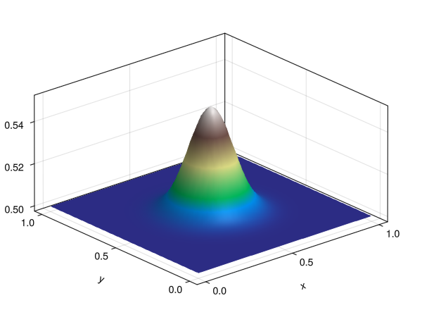
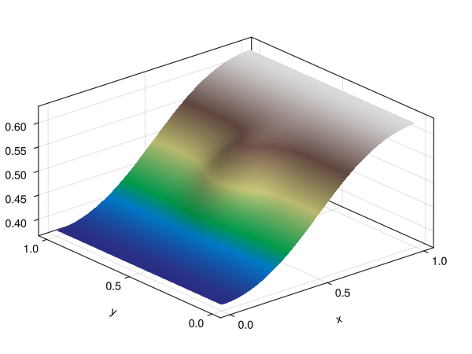
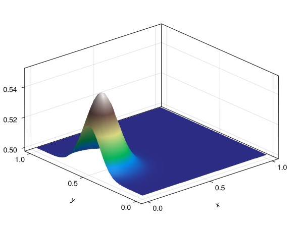
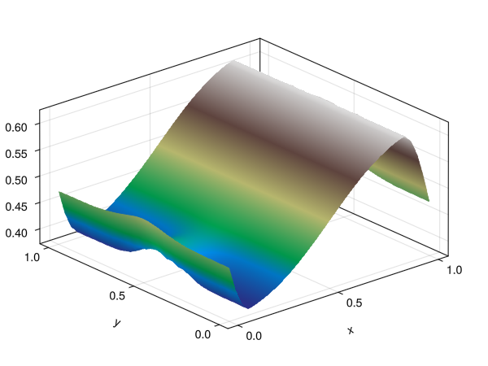

# Marker surface

In three-dimensional geodynamic modeling it is often useful to track a free surface (e.g. the topographic interface between rock and a sticky-air layer). JustPIC.jl provides the `MarkerSurface` object for this purpose: a structured 2D height field `topo[i,j]` defined on a regular horizontal vertex mesh `(xv[i], yv[j])`, living on top of the 3D staggered grid.

We can instantiate a marker surface at a constant elevation `h` as:

`surf = init_marker_surface(backend, xv, yv, h)`

where `backend` is the device backend, `xv` and `yv` are 1D arrays/ranges of the horizontal grid vertices (lengths `nx+1` and `ny+1`), and `h` is either a scalar elevation or an `(nx+1)×(ny+1)` array of initial heights. Optional keyword arguments are `air_phase` (phase ID of the sticky-air layer, default `0`), `periodic_1` and `periodic_2` (enable periodic boundary conditions in the first / second horizontal direction, default `false`).

We can also overwrite the topography of an existing surface from a 2D array:

```julia
# set topography from a pre-computed height field
z_init = [0.4 + 0.1 * sin(2π * xv[i]) * cos(2π * yv[j])
          for i in 1:length(xv), j in 1:length(yv)]
set_topo_from_array!(surf, z_init)
```

The surface is then advected one time step with:

```julia
advect_marker_surface!(surf, V, xvi, dt)
```

where `V = (Vx, Vy, Vz)` is a tuple of 3D velocity arrays on the staggered grid, `xvi = (xv, yv, zv)` is a tuple of 1D vertex coordinate arrays, and `dt` is the time step. The driver performs three steps internally: it trilinearly interpolates the 3D velocity field onto the surface nodes, advects the height field with a deformed-grid triangle scheme, and optionally smooths slopes exceeding `max_slope_angle` (default 45°).

A cheaper first-order alternative is also available:

```julia
semilagrangian_advect_surface!(surf, V, xvi, dt)
```

which updates each vertex by `z += vz·dt` and applies a mass-conservation correction to preserve the mean height.

For coupling with a Stokes solver, the volumetric fraction of each cell that lies below the free surface (the "rock fraction") at every staggered-grid position is computed by:

```julia
compute_rock_fraction!(ratios, surf, xvi, dxi)
```

`ratios` is a named tuple of arrays sized at cell centres, vertices, faces, and edges. The function fills all locations by first computing the fraction at cell centres (via a 4-triangle prism intersection) and then averaging to the surrounding staggered positions.

## Example

```julia
using JustPIC
using JustPIC._3D
using GLMakie

const backend = JustPIC.CPUBackend

# Initialize domain & grids
n = 33
Lx = Ly = Lz = 1.0
xv = LinRange(0, Lx, n)
yv = LinRange(0, Ly, n)
zv = LinRange(0, Lz, n)
xvi = (collect(xv), collect(yv), collect(zv))

# Background flow (3D analytical solenoidal field)
Vx = TA(backend)([ 0.10 * sin(π*x) * cos(π*z)             for x in xv, y in yv, z in zv])
Vy = TA(backend)([ 0.0                                    for x in xv, y in yv, z in zv])
Vz = TA(backend)([-0.10 * cos(π*x) * sin(π*z)             for x in xv, y in yv, z in zv])
V  = Vx, Vy, Vz

# Initialize the surface with a small bump
z_init = [0.5 + 0.05 * exp(-50 * ((x-0.5)^2 + (y-0.5)^2))
          for x in xv, y in yv]
surf = init_marker_surface(backend, xv, yv, z_init)

# Time stepping
dt = 0.05
for _ in 1:25
    advect_marker_surface!(surf, V, xvi, dt; max_slope_angle = 45.0)
end

# Plot the deformed surface
f = Figure()
ax = Axis3(f[1, 1]; aspect = (1, 1, 0.5))
surface!(ax, xv, yv, Array(surf.topo); colormap = :terrain)
display(f)
```




## Periodic boundary conditions

Pass `periodic_1 = true` and/or `periodic_2 = true` to `init_marker_surface` to enable wrap-around boundaries in the first (x) or second (y) horizontal direction. The flags are stored on the surface object and read automatically by every advection and smoothing call — no need to forward them explicitly.

```julia
surf = init_marker_surface(backend, xv, yv, 0.5;
                           periodic_1 = true,   # x periodic
                           periodic_2 = false)  # y non-periodic
```

Under periodic boundaries the ghost cells used by the advection stencil wrap to the opposite side instead of being linearly extrapolated, the slope-limiter's neighbour lookups use `mod1` indexing, and the redundant boundary nodes (`topo[1, :]` and `topo[end, :]`) are kept synchronised after every update. This follows the same convention used by `move_particles!(…; periodic_1, periodic_2, periodic_3)` in JustPIC's particle advection.


## Example

```julia
using JustPIC
using JustPIC._3D
using GLMakie

const backend = JustPIC.CPUBackend

# Initialize domain & grids
n = 33
Lx = Ly = Lz = 1.0
xv = LinRange(0, Lx, n)
yv = LinRange(0, Ly, n)
zv = LinRange(0, Lz, n)
xvi = (collect(xv), collect(yv), collect(zv))

# Background flow (3D analytical solenoidal field)
Vx = TA(backend)([ 0.10 * sin(π*x) * cos(π*z)             for x in xv, y in yv, z in zv])
Vy = TA(backend)([ 0.0                                    for x in xv, y in yv, z in zv])
Vz = TA(backend)([-0.10 * cos(π*x) * sin(π*z)             for x in xv, y in yv, z in zv])
V  = Vx, Vy, Vz

# Initialize the surface with a small bump
z_init = [0.5 + 0.05 * exp(-50 * ((x-0.1)^2 + (y-0.5)^2))
          for x in xv, y in yv]
surf = init_marker_surface(backend, xv, yv, z_init; periodic_1=true)

# Time stepping
dt = 0.05
for _ in 1:25
    advect_marker_surface!(surf, V, xvi, dt; max_slope_angle = 45.0)
end

# Plot the deformed surface
f = Figure()
ax = Axis3(f[1, 1]; aspect = (1, 1, 0.5))
surface!(ax, xv, yv, Array(surf.topo); colormap = :terrain)
display(f)
```


