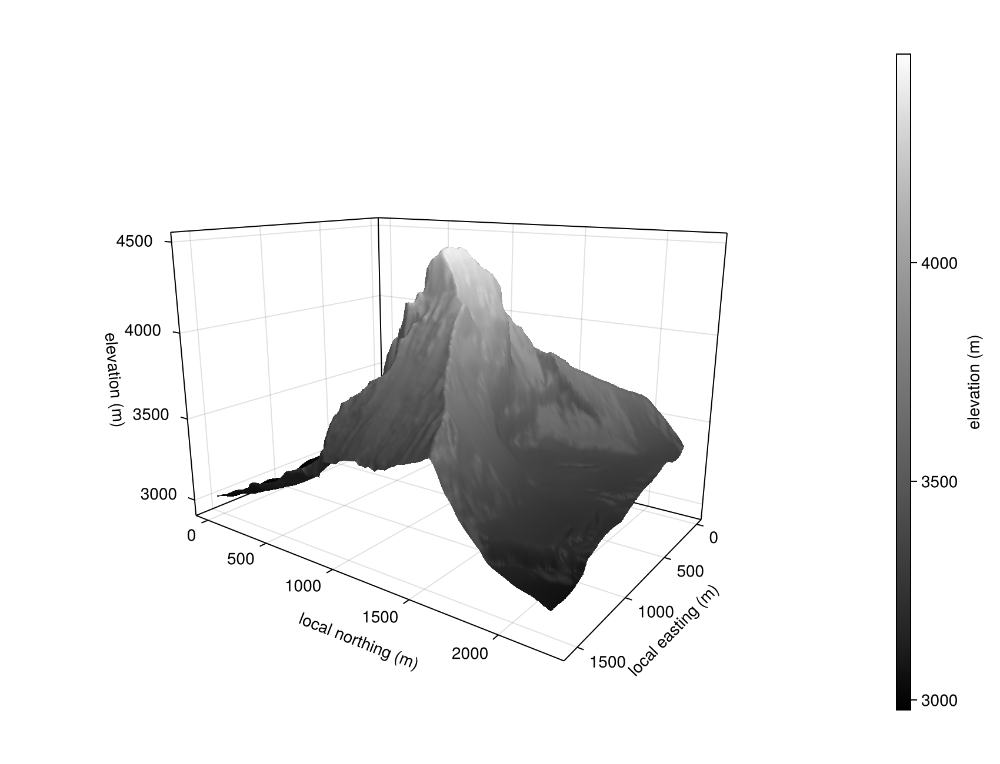
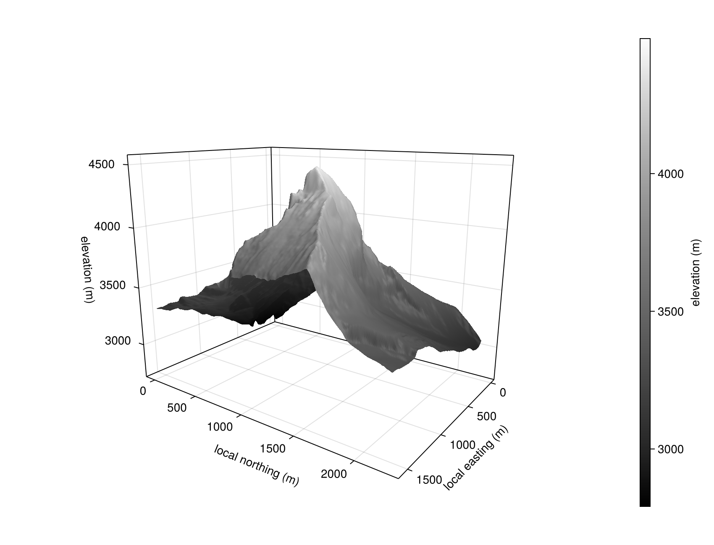
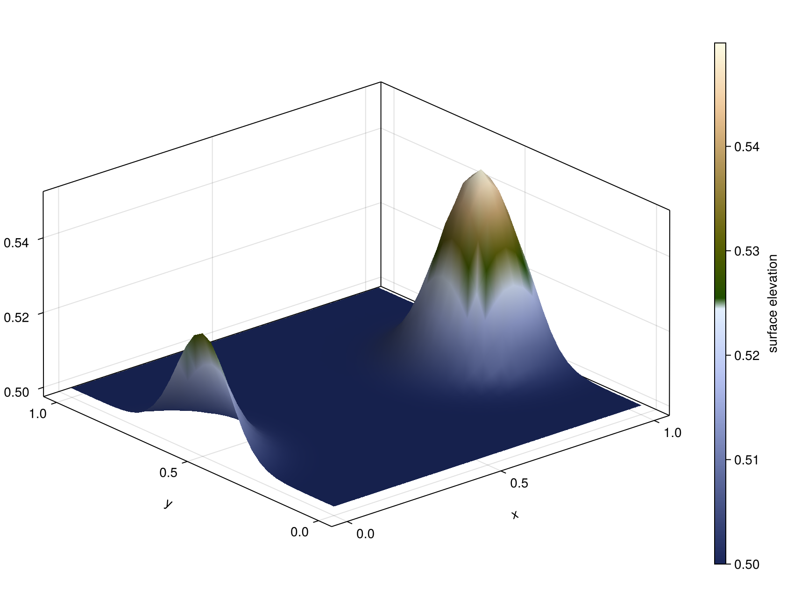
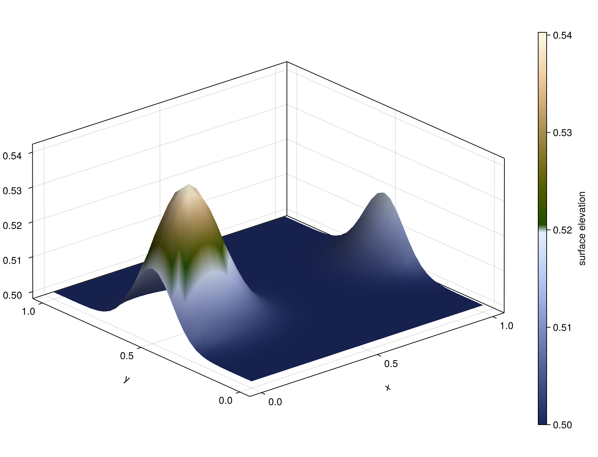

# Marker surface

In three-dimensional geodynamic modeling it is often useful to track a free surface (e.g. the topographic interface between rock and a sticky-air layer). JustPIC.jl provides the `MarkerSurface` object for this purpose: a structured 2D height field `topo[i,j]` defined on a regular horizontal vertex mesh `(xv[i], yv[j])`, living on top of the 3D staggered grid.

We can instantiate a marker surface at a constant elevation `h` as:

`surf = init_marker_surface(backend, xv, yv, h)`

where `backend` is the device backend, `xv` and `yv` are finite, strictly increasing 1D arrays/ranges of the horizontal grid vertices (lengths `nx+1` and `ny+1`), and `h` is either a scalar elevation or an `(nx+1)×(ny+1)` array of initial heights. Optional keyword arguments `periodic_1` and `periodic_2` enable periodic boundary conditions in the first / second horizontal direction.

We can also overwrite the topography of an existing surface from a 2D array:

```julia
# set topography from a pre-computed height field
z_init = [0.4 + 0.1 * sin(2π * xv[i]) * cos(2π * yv[j])
          for i in 1:length(xv), j in 1:length(yv)]
set_topo_from_array!(surf, z_init)
```

The surface is then advected one time step with:

```julia
advect_marker_surface!(surf, V, grid_vxi, dt)
```

where `V = (Vx, Vy, Vz)` is a tuple of 3D velocity arrays and `grid_vxi = (grid_vx, grid_vy, grid_vz)` gives one `(x, y, z)` coordinate tuple per staggered component. Each velocity-array size must equal the lengths of its own coordinate tuple. `dt` is the time step. The driver interpolates the staggered velocity field onto surface nodes, advects the height field with a deformed-grid triangle scheme, and optionally smooths slopes exceeding `max_slope_angle` (default 45°).

For coupling with a Stokes solver, the volumetric fraction of each cell that lies below the free surface (the "rock fraction") at every staggered-grid position is computed by:

```julia
compute_rock_fraction!(ratios, surf, xvi, dxi)
```

`ratios` is a named tuple of arrays sized at cell centres, vertices, faces, and edges. The function evaluates the geometric fraction of every corresponding control volume using the surface's 4-triangle representation.

## Examples

Run the complete CPU examples, which construct the component-specific staggered
grids and regenerate the figures below:

```sh
julia --project=docs docs/examples/marker_surface.jl
```

The batch example uses CairoMakie and Makie's `:Greys` colormap. GLMakie 0.13
remains available in the docs environment for interactive rendering.

The nonperiodic figures use a 193×193, approximately 8 m sample centered on
the Matterhorn summit (45.9763° N, 7.6586° E). It combines
[swisstopo's 0.5 m swissALTI3D DEM](https://www.swisstopo.admin.ch/en/height-models)
on the Swiss side with [ARPA Piemonte's transboundary terrain service](https://webgis.arpa.piemonte.it/agportal/home/item.html?id=955f9b1766ac4e2184a4b6979a5878de)
on the Italian side, whose Valle d'Aosta input is a 2 m LiDAR DTM. Both sources
are resampled to the example grid, preserving the distinct cross-border summit
kink. The simulation rescales elevations to its unit-height domain, but the
Matterhorn figures map them back to the original DEM elevation range and show
local horizontal coordinates in meters. The periodic figures retain a synthetic
surface: an isolated mountain is not a periodic terrain field.






## Periodic boundary conditions

Pass `periodic_1 = true` and/or `periodic_2 = true` to `init_marker_surface` to enable wrap-around boundaries in the first (x) or second (y) horizontal direction. The flags are stored on the surface object and read automatically by every advection and smoothing call — no need to forward them explicitly.

```julia
surf = init_marker_surface(backend, xv, yv, 0.5;
                           periodic_1 = true,   # x periodic
                           periodic_2 = false)  # y non-periodic
```

Under periodic boundaries the ghost cells used by the advection stencil wrap to the opposite side instead of being linearly extrapolated, the slope-limiter's neighbour lookups use `mod1` indexing, and the redundant boundary nodes (`topo[1, :]` and `topo[end, :]`) are kept synchronised after every update. This follows the same convention used by `move_particles!(…; periodic_1, periodic_2, periodic_3)` in JustPIC's particle advection.






## Multi-GPU / MPI (ImplicitGlobalGrid)

The marker surface works with [ImplicitGlobalGrid.jl](https://github.com/eth-cscs/ImplicitGlobalGrid.jl)
domain decomposition, including full 3D (x, y and z) decomposition. Build the
surface from the **local** (rank) vertex coordinates; when a global grid is
active, `advect_marker_surface!` and maximum-angle smoothing automatically
exchange the topography's x/y halo between neighbouring ranks
(`ImplicitGlobalGrid.update_halo!`). When the grid is
decomposed in z, the surface velocity is additionally combined across each
z-column so every node is interpolated from the rank whose slab contains the
surface elevation — no user action required.

```julia
me, dims, nprocs = init_global_grid(nx, ny, nz; periodx = 1, periody = 1)

# local vertex coordinates of this rank
xv = [x_g(i, dx, Vx) for i in 1:(nx + 1)]
yv = [y_g(j, dy, Vy) for j in 1:(ny + 1)]

surf = init_marker_surface(backend, xv, yv, initial_elevation)

for _ in 1:nt
    advect_marker_surface!(surf, V, grid_vxi, dt)   # halo exchange included
end
```

Notes:

- Under MPI, set periodicity through `init_global_grid` (`periodx`/`periody`)
  and leave `periodic_1`/`periodic_2` of the surface as `false` — the local
  flags wrap within the rank-local array and are only meant for single-device
  runs.
- If you modify `surf.topo` manually, call `update_surface_halo!(surf)`
  afterwards to synchronize the ranks.
- `compute_avg_topo` performs an owned-node global reduction, excluding
  overlapping x/y nodes and duplicate z-column replicas.

## Limitations

- Topography, surface velocities, and horizontal coordinates use the promoted floating-point type of `xv`, `yv`, and the initial elevation.
- Under z-decomposition, `interpolate_velocity_to_surface_vertices!` performs a
  few small `Allreduce`s per call over each z-column, directly on the device
  velocity arrays (no host staging). On GPU this requires GPU-aware MPI —
  the same `IGG_CUDAAWARE_MPI=1` / `IGG_ROCMAWARE_MPI=1` setup
  `ImplicitGlobalGrid` already uses for its halo exchange. Grids decomposed only
  in x/y have no such requirement.
