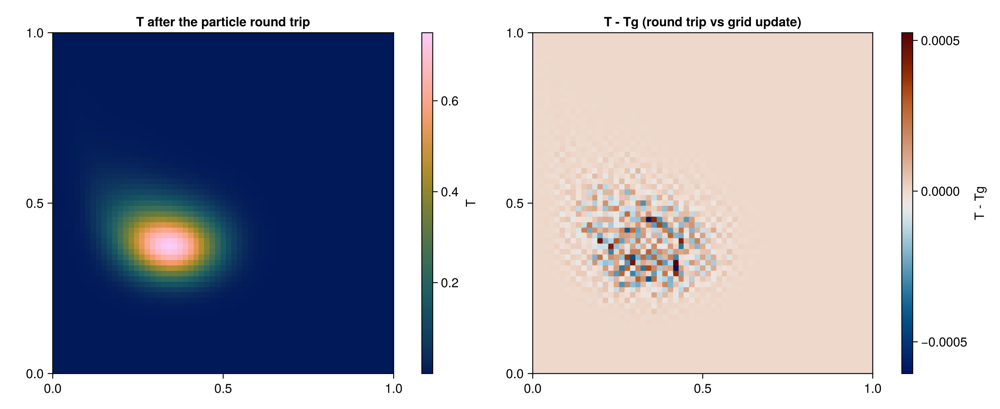

# PIC/FLIP temperature update in 2D

The script
[`scripts/temperature_advection_flip.jl`](https://github.com/JuliaGeodynamics/JustPIC.jl/blob/main/scripts/temperature_advection_flip.jl)
carries a temperature blob through a cellular flow and applies a grid-side
update (explicit diffusion) to it. The update is passed to the particles as an
increment and brought back to the grid as the average particle increment.
See [PIC/FLIP](pic_flip.md) for the functions involved.

Particles and the temperature `T` (at the ghosted centroids) are set up as in
[Field advection in 2D](field_advection2D.md). Besides the particle temperature
`pT`, a second particle field `pT0` stores its value before each update:

```julia
particle_args = pT, pT0 = init_cell_arrays(particles, Val(2))
centroid2particle!(pT, T, particles)
```

Each time step first advects the particles and builds `T` from them:

```julia
advection!(particles, RungeKutta2(), V, dt)
move_particles!(particles, particle_args)
inject_particles!(particles, (pT,))
particle2centroid!(T, pT, particles)
neumann!(T)
```

`particle2centroid!` fills only the interior of `T`. The FLIP transfer below
reads the ghost centroids of both `T` and the updated copy, so their ghost
layers must be consistent. Here both use zero-flux copies from the first
physical centroid (`neumann!`).

The three transfers that follow are the whole method:

```julia
# 1. grid-side update on a copy of T
Tg .= T
diffuse!(Tg, κ, dt, dx, dy)

# 2. grid → particles: pT += interpolated (Tg - T)   (α = 0: pure FLIP)
pT0.data .= pT.data
centroid2particle_flip!(pT, Tg, T, particles; α)

# 3. particles → grid: T += Σω (pT - pT0) / Σω
particle2centroid_flip!(T, pT, pT0, particles)
```

After step 3, `T` equals the grid-side result `Tg` up to the interpolation
error of the two transfers. In this example the relative difference stays
around `5e-4` over 100 steps, and the residual is particle noise inside the
blob:



Cells without particles are left untouched by `particle2centroid_flip!`, and
setting `α > 0` blends in the PIC value, which damps FLIP noise at the cost of
extra diffusion.

To run the example (it saves figures to `figs/`):

```sh
julia --project=. scripts/temperature_advection_flip.jl
```
