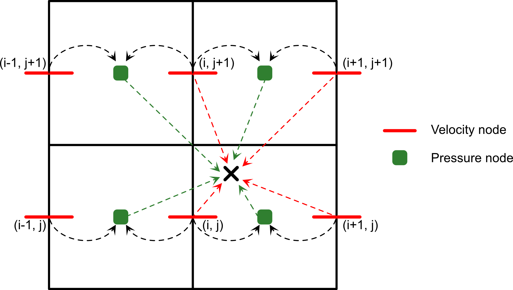

# LinP

Velocity interpolation from [Pusok et al. 2017](https://link.springer.com/article/10.1007/s00024-016-1431-8). The velocity at the m-th particle is given by

$u_m = A u_L + (1-A) u_P$

where $u_L$ is the bi or tri-linear interpolation from the velocity nodes to the particle, $u_P$ is the bi or tri-linear interpolation from the pressure nodes to the particle, and $A=2/3$ is an empirical coefficient.

# Modified Quadratic Spline MQS

Velocity interpolation from [Gerya et al. 2021](https://meetingorganizer.copernicus.org/EGU21/EGU21-15308.html). The scheme guarantee bi-linear interpolation of $\partial u_i/\partial x_i$ from pressure nodes where they are defined by solving (in)compressible continuity equation.

Example for the $u_x$ component in 2D:

*Step 1* Compute the normalized distances between particle and left-bottom corner of the cell:

$t_{x} = 1 - \frac{x_m - xc_j}{\Delta x}$

$t_{y} =  1 - \frac{y_m - yc_j}{\Delta y} $

*Step 2* Compute $u_x$ velocity with bi-linear scheme for the bottom and top

$u_{m}^{(13)} = u_{i,j} t_x + u_{i,j+1} (t_x-1)$

$u_{m}^{(23)} = u_{i+1,j} t_x + u_{i+1,j+1} (t_x-1)$

*Step 3* Compute $u_x$ of the marker with bi-linear scheme in vertical direction

$u_{m}^{(13)} = u_{m}^{(13)} + \frac{1}{2} (t_x-\frac{3}{2})^2 (u_{i,j-1}-2u_{i,j}+u_{i,j-1})$

$u_{m}^{(24)} = u_{m}^{(24)} + \frac{1}{2} (t_x-\frac{3}{2})^2 (u_{i+1,j-1}-2u_{i+1,j}+u_{i+1,j-1})$

*Step 4* Compute $u_x$  vx of the marker with bi-linear scheme in vertical direction

$u_{m} = t_y u_{m}^{(13)}+(t_y-1) u_{m}^{(24)}$