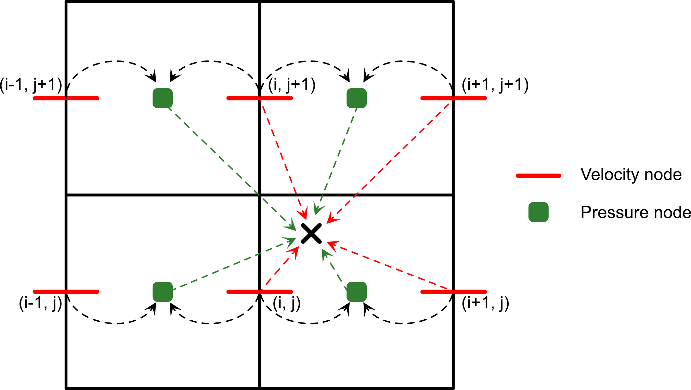

# Velocity interpolation

Particle and marker advection needs velocities at particle positions, while
geodynamic velocity fields are usually stored on staggered grids. JustPIC offers
three interpolation paths for this step.

## Linear

The default `advection!` path uses bilinear interpolation in 2D and trilinear
interpolation in 3D. This is the cheapest and most general option, and it is the
right default for most examples and tests.

## LinP

`advection_LinP!` uses the linear-plus-pressure interpolation described by
[Pusok et al. 2017](https://link.springer.com/article/10.1007/s00024-016-1431-8).
The velocity at the `m`-th particle is given by

$u_m = A u_L + (1-A) u_P$

where $u_L$ is the bi- or trilinear interpolation from velocity nodes to the
particle, $u_P$ is the interpolation from pressure nodes to the particle, and
$A = 2/3$ is an empirical coefficient.

## Modified Quadratic Spline

`advection_MQS!` uses the modified quadratic spline interpolation from
[Gerya et al. 2021](https://meetingorganizer.copernicus.org/EGU21/EGU21-15308.html).
The scheme is designed so that velocity derivatives can be reconstructed from
pressure-node locations where they are constrained by the continuity equation.
Near boundaries, where the required stencil is unavailable, the implementation
falls back to the linear interpolation path.

Example for the $u_x$ component in 2D:

Step 1: compute the normalized distances between the particle and the lower-left
corner of the interpolation cell:

$t_{x} = \frac{x_m - xc_j}{\Delta x}$

$t_{y} = \frac{y_m - yc_j}{\Delta y}$

Step 2: compute the bottom and top intermediate values:

$u_{m}^{(13)} = u_{i,j} t_x + u_{i,j+1} t_x$

$u_{m}^{(23)} = u_{i+1,j} t_x + u_{i+1,j+1} t_x$

Step 3: add the quadratic correction:

$u_{m}^{(13)} = u_{m}^{(13)} + \frac{1}{2} (t_x-\frac{1}{2})^2 (u_{i,j-1}-2u_{i,j}+u_{i,j-1})$

$u_{m}^{(24)} = u_{m}^{(24)} + \frac{1}{2} (t_x-\frac{1}{2})^2 (u_{i+1,j-1}-2u_{i+1,j}+u_{i+1,j-1})$

Step 4: interpolate the corrected values in the vertical direction:

$u_{m} = (1-t_y) u_{m}^{(13)}+(t_y) u_{m}^{(24)}$

## Choosing a Scheme

- Use `advection!` for the default linear interpolation.
- Use `advection_LinP!` when matching the LinP reconstruction from the cited PIC literature.
- Use `advection_MQS!` when the modified quadratic spline stencil is desired and the grid has enough interior support.
- Use `semilagrangian_advection!`, `semilagrangian_advection_LinP!`, or `semilagrangian_advection_MQS!` for grid-field backtracking with the corresponding velocity reconstruction.
